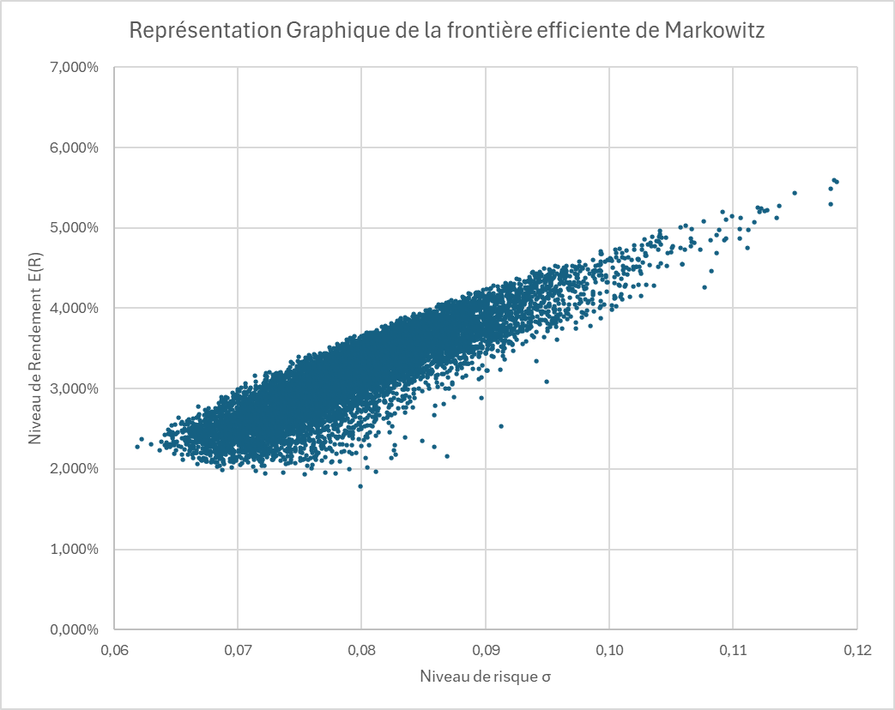
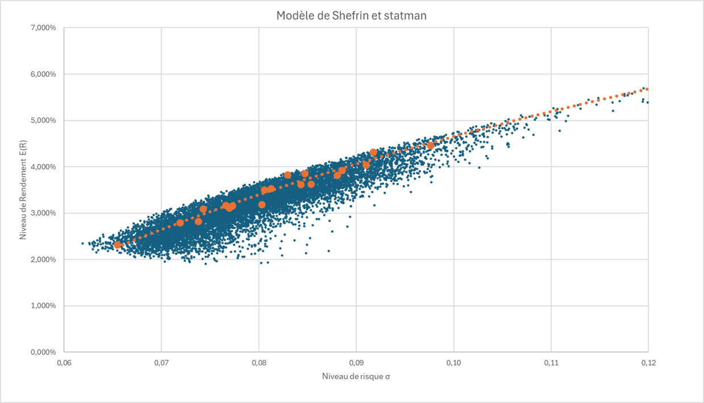

### 📊 **Project Overview: Behavioral Finance and Portfolio Optimization**

This report presents a comparative analysis of two financial models applied to portfolio management: the **Markowitz efficient frontier** and the **Shefrin-Statman model**, focusing on behavioral finance principles.

---

### 🚀 **Key Elements of the Report**

#### 1. **Selected Assets from NASDAQ-100**
The report evaluates five major tech companies:

- **NVIDIA (NVDA)**: High volatility, driven by growth in AI and graphics processing.
- **Apple (AAPL)**: Stable returns with ongoing innovation in products and services.
- **Microsoft (MSFT)**: Low volatility, benefiting from enterprise software and cloud services.
- **Alphabet (GOOG)**: Steady growth from advertising and cloud services, but faces antitrust risks.
- **Amazon (AMZN)**: Diversified growth in e-commerce and cloud, though under regulatory scrutiny.

---

#### 🔍 2. **Statistical Measures**
 The analysis includes essential performance metrics for each asset:

- **Expected Return**: Highest for NVIDIA, lowest for Amazon.
- **Standard Deviation**: NVIDIA shows the highest risk, while Microsoft shows the lowest.
- **Variance**: Reinforces the observations on volatility.
- **Sharpe Ratio**: NVIDIA exhibits the best risk-adjusted performance, while Amazon ranks lowest.
- **Correlation Matrix**: Alphabet’s stock is less correlated with others, while Microsoft's is more aligned with portfolio peers.

---

#### 📄 3. **Efficient Frontier Interpretation (Markowitz Model)**
- **Risk and Return Axes**: The portfolio risk ranges from 6% to 12%, while expected returns range from 0% to 7%.
- **Efficient Frontier Curve**: Portfolios on the upper boundary are optimized, offering the highest return for a given risk.

For this study, generating 50,000 portfolios resulted in an optimal risk-return combination of **6.337% risk** for **2.224% return**.

---

#### 🛠️ 4. **Behavioral Frontier (Shefrin-Statman Model)**
- This model emphasizes **"downside risk"**, focusing on protecting against significant losses rather than maximizing returns.
- The efficient frontier in this model is slightly higher than Markowitz’s, suggesting better returns at similar risk levels.
- The optimal portfolio seeks a threshold return of -5% with an alpha of 5%.

The resulting portfolio weights are:
| Stock   | Weight   |
|---------|----------|
| NVIDIA  | 31.35%   |
| Apple   | 9.68%    |
| Microsoft | 26.41% |
| Alphabet | 32.19%  |
| Amazon  | 0.36%    |

---

### 📈 **Conclusions and Insights**
- The Shefrin-Statman model offers a **behaviorally adjusted optimization**, providing potentially better diversification and returns by accounting for investor psychology.
- Investors can benefit from this approach by focusing on **loss minimization** and **risk aversion**.
